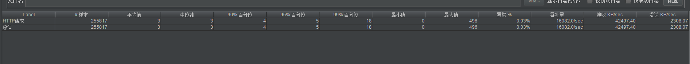

# 活动平台  ACTIV

## 项目结构

 activ

├── activ-bom                             -- BOM 公共版本控制模块
|
├── activ-common                     -- 基础模块
|
├── activ-entity                           -- 公共实体模块
|
├── activ-shuffle                         -- 数据落地模块 [XXXX]
|    └── 对应功能
|           └─ 数据接入、清洗、写入数据库、载入redis
|
├── activ-handle                         -- 活动处理模块 [XXXX]   (暂废)
|    └── 对应功能
|           └─ 活动处理
|
├── activ-operation                    -- 活动处理模块 [XXXX]
|    └── 对应功能
|           └─ 活动处理
|
└── activ-notify                           -- 消费通知模块 [XXXX]
     └── 对应功能
             └─ 通知下游（外联）平台

* 项目采用1+N+1服务完成对XXXXH5活动平台的支持，其中第一个1代表数据落地模块，N代表具体活动，最后一个1为通知模块。
* 前后端交互需增加sign头标识，用于用户唯一标识；通过用户唯一标识限流，最快每秒一次，支持分布式部署。
* // FIXME 或者可以将活动处理模块中具体的活动查询等逻辑抽取出来做单独服务。

## 开发线路：

### 完成 数据落地模块 中的数据清洗及落地（待完成，优先级★★★★☆）

支持定时任务配置及用户、活动、奖品表的动态更新到 redis 中。

1. 使用sftp下载原始数据文件并保存到所对应活动的固定目录，用于追溯
2. 解析下载的数据并保存到mysql数据库中
3. 保存到mysql数据库的同时更新相应活动的redis的数据

### 完成对应活动的 活动处理模块 的业务逻辑处理（部分完成，优先级★★★★★）

当前查询需在活动有效期内（除单纯逻辑）

#### 短信验证模块：

​	发送短信：同一号码每日最多发送6次，每次间隔至少1分钟，每次有效期5分钟。

​	验证短信：验证短信是否过期、验证短信是否正确。

#### 活动模块：

​	查询活动：

​		通过在redis查询当前所有有效活动。

​		通过id在redis中查询对应活动。

#### 奖品模块：

​	查询奖品：

​		通过活动id在redis中查询当前所有奖品。

#### 订单模块：

​	查询订单：

​		通过用户标识在redis中查询当前用户中奖订单。

#### 具体活动处理模块：

​	用户验证：通过用户传入手机号+身份证 加密 在 数据落地模块的具体活动用户名单中 查询是否存在，不存在则验证不成功。

​	具体处理：用户验证通过后处理具体业务逻辑，并插入到mysql订单表中及redis订单中。

### 完成 消费通知模块 的业务逻辑处理（待完成，优先级★☆☆☆☆）

定时执行加载时间段内的订单表中所有需通知的新订单数据。异步方式执行对应活动通知，并更新数据到mysql和redis中。

## 开发工具

IntelliJ IDEA + Navicat 

## 压测工具

JMeter

## 开发技术

后端技术 ：SpringBoot + MyBatisPlus + MySQL

中间件技术 : hikari+ Redis + lettuce + Guava

## 抽奖、秒杀处理方向

将请求尽量拦截在系统上游，避免数据读写锁冲突，通过用户标识限流、降级等措施来最大化减少对数据的访问，从而保护系统。

充分利用缓存：秒杀商品是一个典型的读多写少的应用场景，充分利用缓存将大大提高并发量

### 全局异常统一处理

通过拦截所有异常，对各种异常进行相应的处理，当遇到异常就逐层上抛，一直抛到最终由一个统一的、专门负责异常处理的地方处理，这有利于对异常的维护。在有信心的基础上禁打堆栈信息。

### 请求二级缓存

支持分布式部署，避免会话缓存维护，禁用一级缓存，采用二级缓存。
请求缓存：将请求有效响应缓存到redis，利用缓存来减少对数据库的访问，大大加快查询速度。

### 使用RateLimiter实现限流

描述：当我们去秒杀一些商品时，此时可能会因为访问量太大而导致系统崩溃，此时要使用限流来进行限制访问量，当达到限流阀值，后续请求会被降级；降级后的处理方案可以是：返回排队页面（高峰期访问太频繁，等一会重试）、错误页等。

实现：项目使用RateLimiter来实现限流，RateLimiter是guava提供的基于令牌桶算法的限流实现类，通过调整生成token的速率来限制用户频繁访问秒杀页面，从而达到防止超大流量冲垮系统。（令牌桶算法的原理是系统会以一个恒定的速度往桶里放入令牌，而如果请求需要被处理，则需要先从桶里获取一个令牌，当桶里没有令牌可取时，则拒绝服务）

## 压测报告

基础框架，不含业务逻辑（dell灵越5402：8核16G）

###### 项目完成时间：2021年6月